# System Zarzadzania Klubem Pilkarskim (Oracle APEX)

Projekt aplikacji webowej wykonanej w Oracle APEX.
Aplikacja wspiera zarzadzanie klubem pilkarskim (m.in. zawodnicy, kluby, terminarz, transfery, statystyki sezonu i sztab szkoleniowy).

## Tech stack

- Oracle APEX 24.2.x
- Oracle Database
- SQL / PL/SQL

## Jak uruchomic projekt

1. Zaloguj sie do APEX i zaimportuj aplikacje z pliku `apex/f156.sql`.
2. Uruchom skrypty z folderu `db/` (opcjonalne jeśli import nie wystarczy).
3. Otworz aplikacje i zweryfikuj dzialanie stron.

## Funkcjonalnosci

- Zarzadzanie zawodnikami
- Zarzadzanie klubami
- Przeglad terminarza
- Obsluga transferow
- Statystyki sezonu
- Zarzadzanie sztabem szkoleniowym

## Screenshots

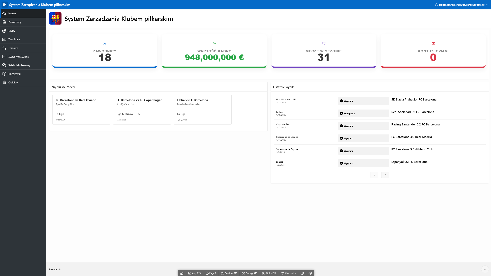

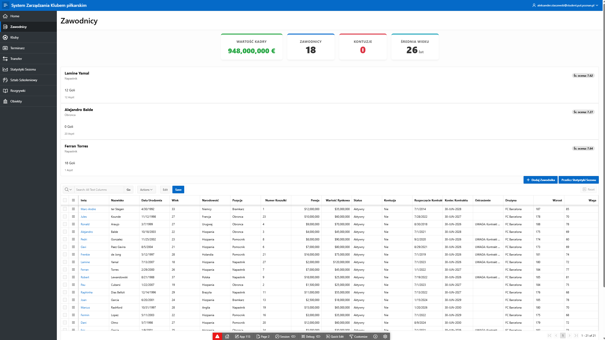

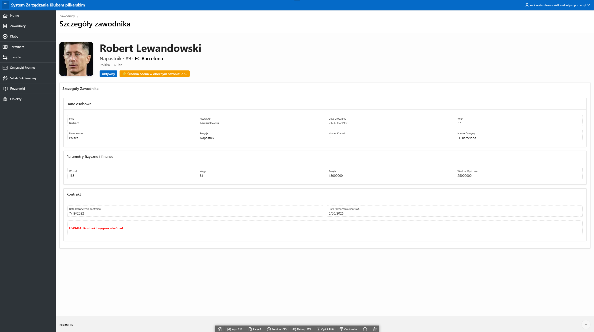

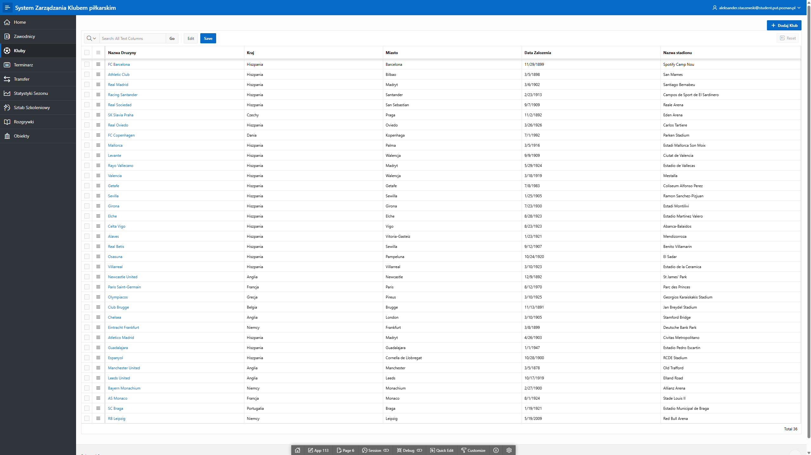

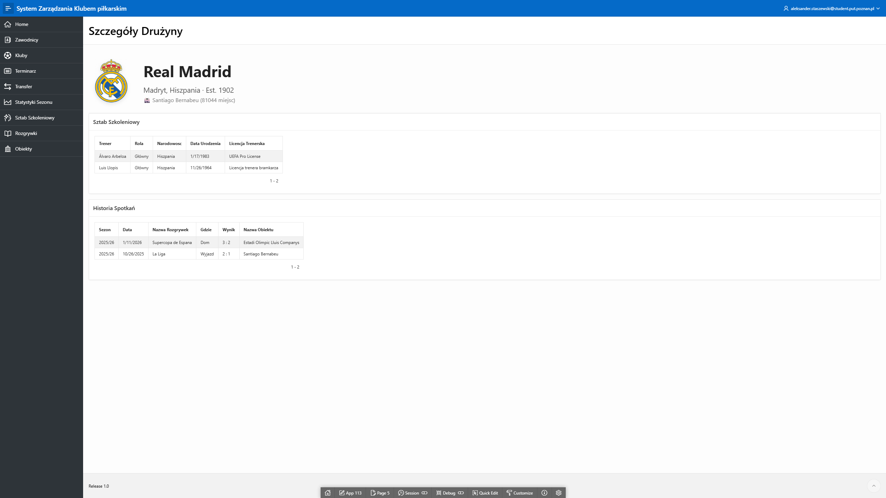

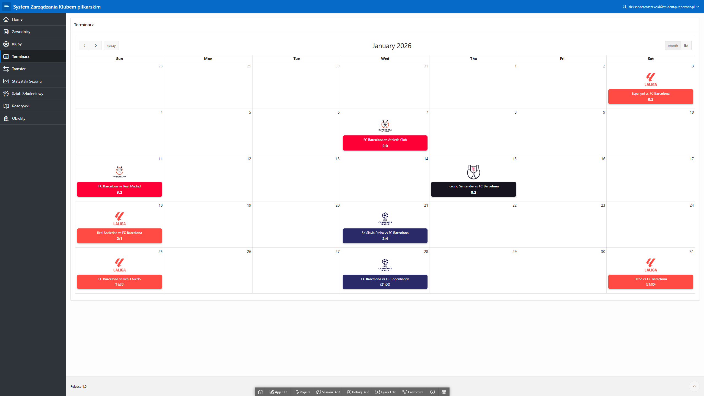

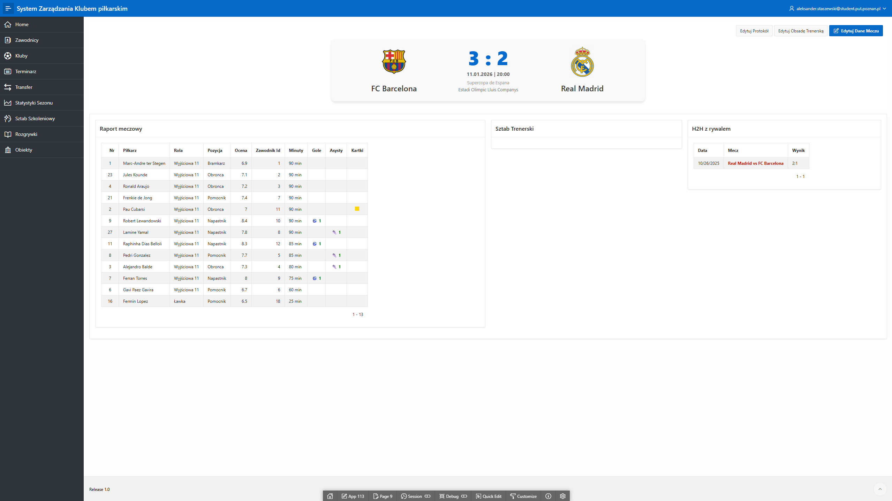

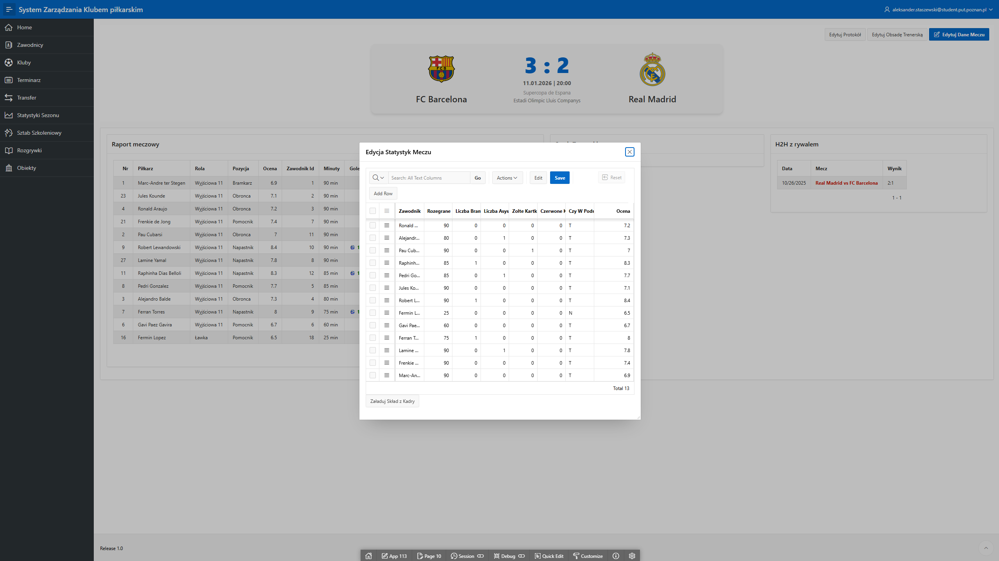

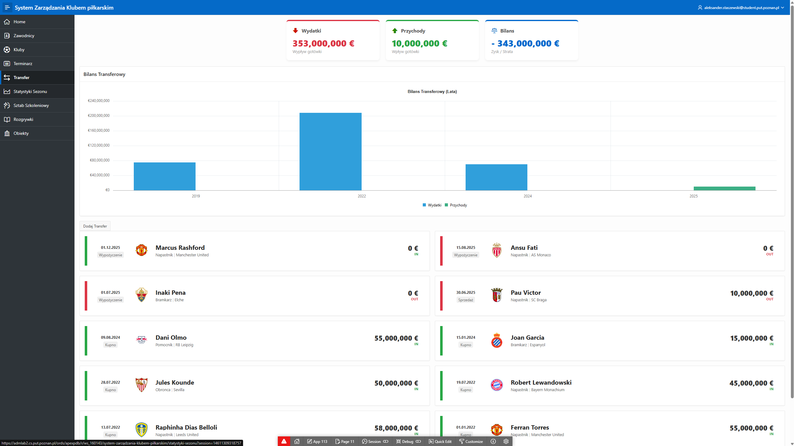

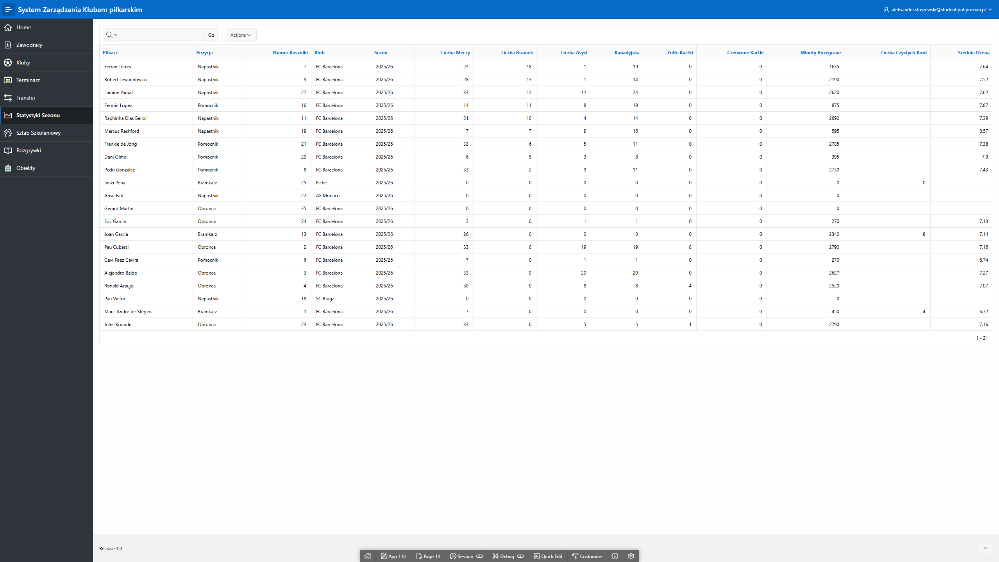

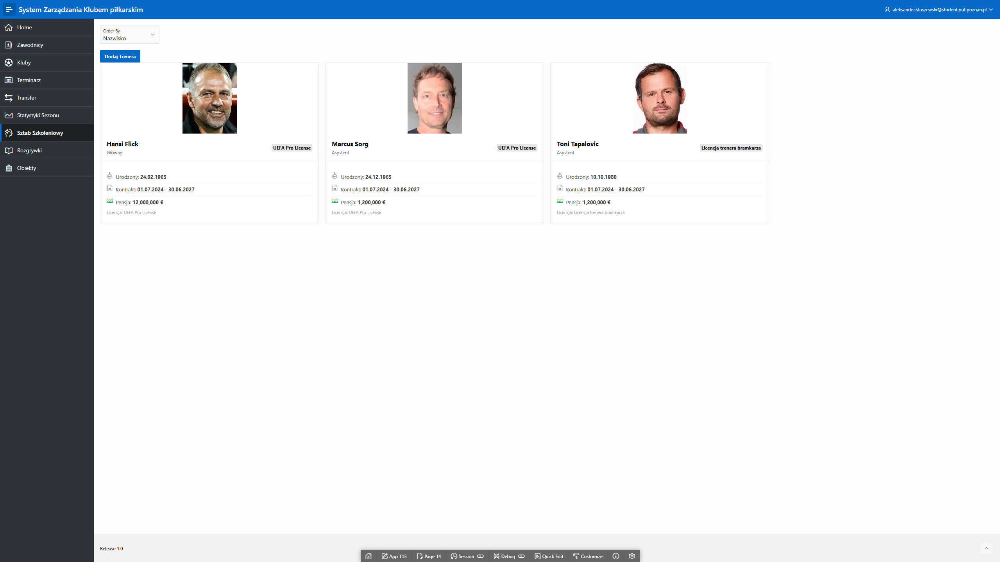

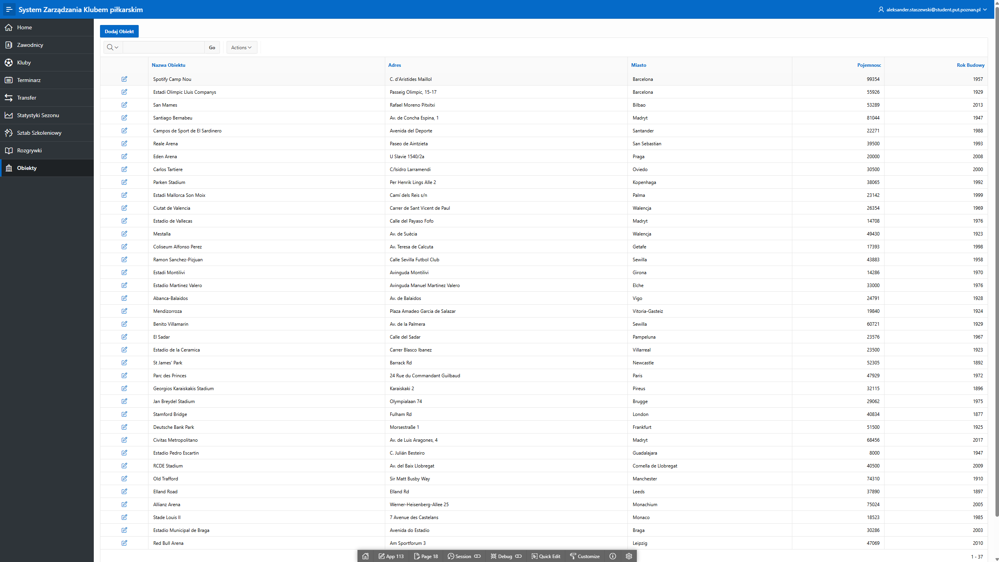

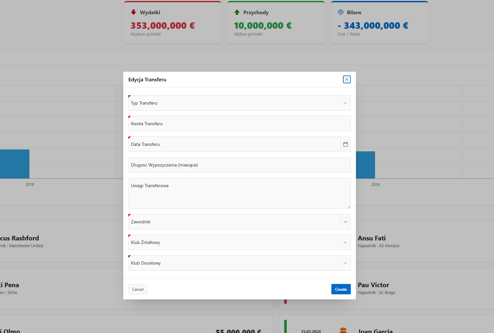

## Autor

- Aleksander Staszewski
